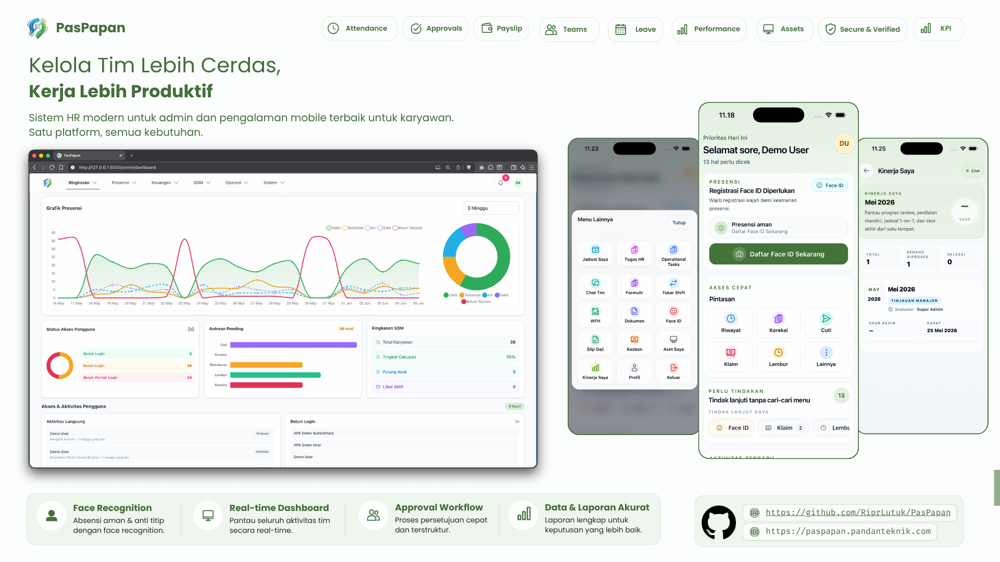

<div align="center">



# PasPapan

Platform manajemen tenaga kerja berbasis Laravel untuk absensi aman, approval, onboarding/offboarding, payroll preparation, reporting, aset, dan operasi HR.

[](https://laravel.com)
[](https://livewire.laravel.com)
[](https://tailwindcss.com)
[](https://www.php.net)

</div>

> Dokumentasi utama project ini memakai Bahasa Indonesia.

## Ringkasan

PasPapan adalah aplikasi workforce untuk organisasi yang membutuhkan absensi mobile, HR checklist onboarding/offboarding, workflow approval, persiapan payroll, import/export, reporting, dan maintenance system dalam satu aplikasi Laravel deployable.

Fokus utama aplikasi:

- absensi aman dengan GPS, foto, Face ID, static barcode, dan Dynamic QR
- HR Checklist v2 untuk onboarding/offboarding, task dependency ringan, overdue indicator, attachment task, summary clearance, dan self-service HR Tasks
- attendance risk scoring untuk mock location, radius boundary, device context, barcode source, face verification, offline/cached location, dan jam di luar shift
- panel admin untuk karyawan, absensi, cuti, lembur, reimbursement, kasbon, aset, payroll, reports, settings, dan maintenance
- self-service karyawan untuk check-in/out, koreksi absensi, cuti, lembur, reimbursement, slip gaji, dokumen, jadwal, HR tasks, dan approval tim
- approval matrix reusable untuk reimbursement, kasbon, koreksi absensi, cuti, lembur, asset/document/payroll-sensitive workflow foundation
- import/export background dengan progress run, ringkasan sukses/error, download hasil, dan cleanup otomatis
- operational health dashboard untuk queue, scheduler, backup, disk, database, cache/session/queue driver, app version, Reverb/polling, dan license status
- wrapper Android berbasis Capacitor untuk kebutuhan APK
- modul enterprise-gated untuk fitur lanjutan tertentu

Detail fitur lengkap ada di [guides/features.md](./guides/features.md).

## Stack

- Laravel `11`
- PHP `8.2+`
- Livewire `3`
- Tailwind CSS `3.4`
- Vite `7`
- MySQL atau MariaDB
- Bun untuk dependency frontend dan build asset
- Pest untuk test suite
- Capacitor untuk wrapper Android
- Android SDK `35` dengan minimum Android API `24`

Runtime default aplikasi database-centric:

- `DB_CONNECTION=mysql`
- `QUEUE_CONNECTION=database`
- `CACHE_STORE=database`
- `SESSION_DRIVER=database`
- `FILESYSTEM_DISK=local`
- realtime announcement hybrid: shared hosting memakai fallback polling ringan, VPS bisa memakai Reverb WebSocket
- timezone `Asia/Jakarta`
- locale `id`

Modul HR Checklist berjalan tanpa Redis, Horizon, atau Reverb sebagai baseline. Data checklist disimpan di database dan dapat dipakai di shared hosting selama migration, session, cache, dan queue database dasar tersedia.

Catatan PHP 8.5: konfigurasi aplikasi sudah memakai `Pdo\Mysql::ATTR_SSL_CA` ketika tersedia. Entry point CLI/web sementara mengabaikan `E_DEPRECATED` pada PHP 8.5+ agar warning vendor Laravel untuk `PDO::MYSQL_ATTR_SSL_CA` tidak tampil sampai framework upstream memperbarui default config.

Vercel memakai runtime serverless, jadi default production-nya berbeda dari VPS/shared hosting:

- `SESSION_DRIVER=cookie`
- `CACHE_STORE=array`
- `QUEUE_CONNECTION=sync`
- `LOG_CHANNEL=stderr`
- `APP_STORAGE_PATH=/tmp/storage`
- `BROADCAST_CONNECTION=log`

Gunakan [`.env.vercel.example`](./.env.vercel.example) sebagai template environment Vercel. Jangan memakai `SESSION_DRIVER=database`, `CACHE_STORE=database`, atau `QUEUE_CONNECTION=database` di Vercel kecuali ada worker/cache eksternal yang memang sudah disiapkan.

## Rilis Terbaru

Rilis terbaru: [`v4.3.0`](https://github.com/RiprLutuk/PasPapan/releases/tag/v4.3.0)

- APK Android: [`PasPapan-v4.3.0.apk`](https://github.com/RiprLutuk/PasPapan/releases/download/v4.3.0/PasPapan-v4.3.0.apk)
- Changelog: [`CHANGELOG.md`](./CHANGELOG.md)
- ID aplikasi Android: `com.pandanteknik.paspapan`
- Versi Android: `4.3.0` (`versionCode 43`)

Sorotan `v4.3.0`:

- security matrix, multi-company isolation guard, private attachment policy, dan CI security scanning diperluas
- Playwright smoke workflow dan Android attendance smoke tersedia untuk regresi utama
- screenshot katalog menu diperbarui menjadi 62 halaman untuk desktop dan APK
- source review enterprise dipisahkan dari artifact runtime obfuscated melalui `.gitattributes` dan panduan packaging

## Enterprise Offline

Rilis ini memperkuat mode enterprise offline tanpa server lisensi:

- lisensi bertanda tangan mendukung allow-all atau daftar fitur spesifik
- gate enterprise mengecek fitur per modul, bukan hanya status lisensi global
- validasi lisensi memakai cache request dan cache aplikasi agar menu/gate tidak mem-parse lisensi berulang
- runtime enterprise sudah dioptimalkan agar proteksi offline tidak membuat halaman admin lambat
- komponen internal penerbitan lisensi tidak disertakan pada deployment klien

## HR Checklist

Modul `HR Checklists` membantu HR UMKM memastikan onboarding dan offboarding tidak bergantung pada ingatan manual.

- Admin/HR membuka `Master Data > HR Checklists` untuk membuat case onboarding atau offboarding.
- Template default dibuat otomatis untuk onboarding dan offboarding.
- Task dapat ditugaskan ke HR, karyawan, atau atasan langsung karyawan.
- Task menampilkan overdue indicator, dependency sederhana, dan attachment privat bila task membutuhkan bukti dokumen.
- Karyawan dan manager membuka `HR Tasks` dari quick action untuk menyelesaikan task mereka.
- Summary completion/clearance membantu HR melihat kesiapan onboarding/offboarding.
- RBAC memakai permission `admin.hr_checklists.view` dan `admin.hr_checklists.manage`.
- Semua label UI tersedia di `lang/id.json` dan `lang/en.json`.

## Quick Start

```bash
git clone https://github.com/RiprLutuk/PasPapan.git
cd PasPapan

composer install
bun install
cp .env.example .env
php artisan key:generate
php artisan migrate --seed
php artisan storage:link
```

Jalankan aplikasi:

```bash
php artisan serve
bun run dev
```

Opsional untuk tes background job lokal:

```bash
php artisan queue:work database --queue=maintenance,default
```

## Environment Minimal

```dotenv
APP_NAME=PasPapan
APP_ENV=local
APP_DEBUG=true
APP_URL=http://127.0.0.1:8000

DB_CONNECTION=mysql
DB_HOST=127.0.0.1
DB_PORT=3306
DB_DATABASE=absensi
DB_USERNAME=your_user
DB_PASSWORD=your_password

QUEUE_CONNECTION=database
SESSION_DRIVER=database
CACHE_STORE=database
BROADCAST_CONNECTION=log
ANNOUNCEMENT_REFRESH_MODE=auto
ANNOUNCEMENT_POLL_INTERVAL=60s
```

## Realtime Hybrid

PasPapan mendukung dua mode announcement/notification refresh:

- Shared hosting UMKM: gunakan `BROADCAST_CONNECTION=log` dengan `ANNOUNCEMENT_REFRESH_MODE=auto`. Aplikasi fallback ke polling ringan setiap `ANNOUNCEMENT_POLL_INTERVAL`.
- VPS: gunakan `BROADCAST_CONNECTION=reverb`. Aplikasi memakai Laravel Reverb + Echo sehingga announcement baru dikirim lewat WebSocket tanpa polling berkala.

Contoh VPS Reverb:

```dotenv
BROADCAST_CONNECTION=reverb
ANNOUNCEMENT_REFRESH_MODE=auto
REVERB_APP_ID=local-paspapan
REVERB_APP_KEY=change-me
REVERB_APP_SECRET=change-me-secret
REVERB_HOST=your-domain.com
REVERB_PORT=443
REVERB_SCHEME=https
REVERB_SERVER_HOST=0.0.0.0
REVERB_SERVER_PORT=8080
```

Di VPS jalankan proses long-running:

```bash
php artisan queue:work database --queue=maintenance,default --tries=3 --timeout=1800
php artisan reverb:start
```

## Deployment

Target produksi paling lengkap adalah VPS karena PasPapan memakai queue worker, scheduler, storage lokal, dan background job.

Panduan deployment dipisahkan di [guides/deployment.md](./guides/deployment.md):

- VPS dengan Nginx/Apache, Supervisor, dan cron
- shared hosting dengan cron fallback
- Vercel memakai [`vercel-community/php`](https://github.com/vercel-community/php)

File pendukung Vercel yang sudah tersedia:

- [`vercel.json`](./vercel.json)
- [`api/index.php`](./api/index.php)
- [`api/php.ini`](./api/php.ini)
- [`.env.vercel.example`](./.env.vercel.example)
- [`.vercelignore`](./.vercelignore)

Catatan Vercel: set semua environment variable lewat Vercel Dashboard atau CLI, lalu redeploy. Untuk TiDB/MySQL managed yang butuh TLS, isi `MYSQL_ATTR_SSL_CA` sesuai path CA runtime provider.

## Operasi

Panduan operasional ada di [guides/operations.md](./guides/operations.md):

- queue dan scheduler
- backup dan maintenance
- import/export run retention
- workflow update
- testing dan quality check
- Android build
- catatan produksi

Command yang paling sering dipakai:

```bash
php artisan queue:work database --queue=maintenance,default --tries=3 --timeout=1800
php artisan schedule:run
php artisan queue:failed
php artisan queue:retry all
php artisan queue:restart
```

## Testing

```bash
php artisan test --without-tty
composer check:ui
./vendor/bin/pint --test
composer phpstan
composer audit
bun run build
```

Smoke dan screenshot tambahan:

```bash
bun run e2e:smoke
bun run screenshots:desktop
bun run screenshots:apk
bun run apk:e2e:attendance
```

Screenshot katalog saat ini berisi 62 halaman menu/page untuk desktop dan APK. Manifest berada di:

- [`screenshots/desktop-pages/manifest.json`](./screenshots/desktop-pages/manifest.json)
- [`screenshots/apk-pages/manifest.json`](./screenshots/apk-pages/manifest.json)

## Demo

Gunakan platform di sandbox simulasi terbatas.

Link akses:

- Demo Vercel: [paspapan.vercel.app](https://paspapan.vercel.app)
- Demo produksi: [paspapan.pandanteknik.com](https://paspapan.pandanteknik.com)

Akun demo:
| Role | Email Login | Password |
| --- | --- | --- |
| Admin | `admin123@paspapan.com` | `12345678` |
| User | `user123@paspapan.com` | `12345678` |

Akun demo hanya boleh dipakai untuk environment lokal/staging yang sengaja disiapkan oleh operator. Kredensial demo tidak dipublikasikan di README dan tidak boleh digunakan ulang sebagai kredensial produksi. Demo Vercel berjalan di runtime serverless, sehingga fitur yang bergantung pada worker/background job panjang, storage lokal permanen, atau proses realtime long-running lebih cocok diuji di deployment VPS/shared hosting.

## Dukung Pengembangan

Kalau project ini membantu tim Anda dan Anda ingin mendukung pengembangannya, silakan scan QR GoPay berikut.

<div align="center">
  
  <p><strong>GoPay Support</strong></p>
</div>

## Kredit

[RiprLutuk](https://github.com/RiprLutuk).
